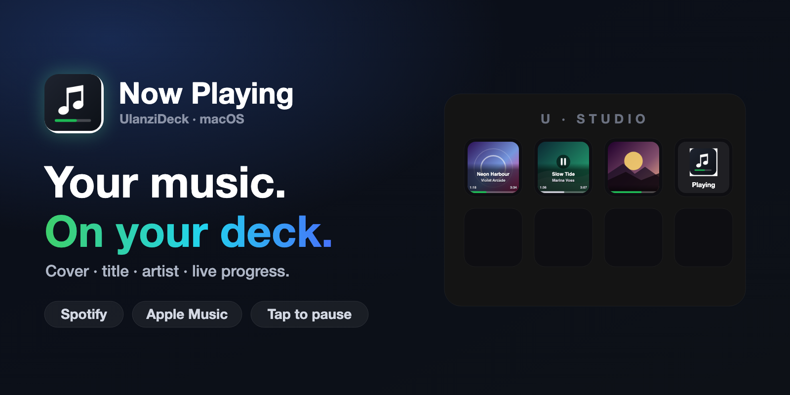
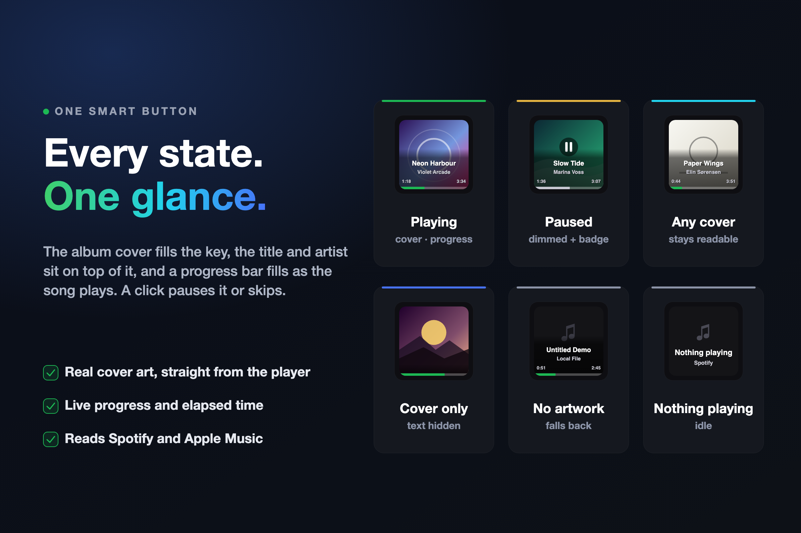
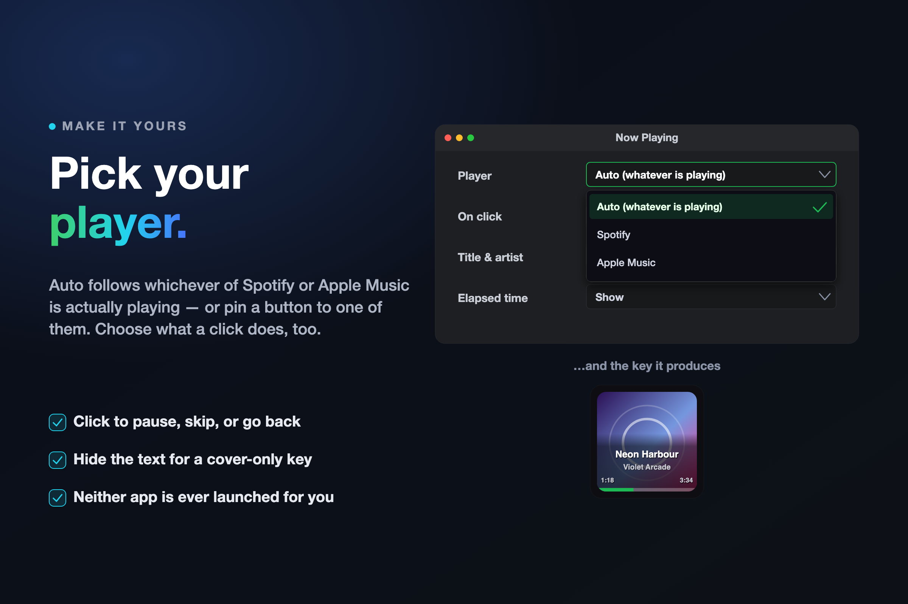

# Now Playing - Ulanzi Deck Plugin

**The song you're hearing — live on a physical button.**

Album cover, title, artist and a progress bar that fills as the track plays. No window switching, no menu bar hunting.



[](https://ulanzicommunitystore.narlei.com)
[](LICENSE)
[]()
[]()
[]()

> **Disclaimer:** this is an independent, open-source project. It is **not affiliated with, endorsed by, or supported by Spotify or Apple**. "Spotify" and "Apple Music" are trademarks of their respective owners.

---

## Why this exists

You're deep in a build, a call ends, a track you like comes on — and finding out what it is costs you a window switch. Or you want to pause without hunting for the right app.

Now Playing puts the cover art on a key in front of you, with the title, the artist, and how far into the song you are. One click pauses it or skips.

---

## Install

From the [Ulanzi Community Store](https://ulanzicommunitystore.narlei.com), or locally:

```bash
git clone https://github.com/narlei/ulanzideck_now_playing
cd ulanzideck_now_playing
make install
```

> **Requirements:** macOS 10.15+ · [Ulanzi Studio](https://www.ulanzi.com/pages/download) 3.0.11+ · the Spotify and/or Apple Music **desktop** app

`make install` copies the plugin into UlanziDeck and restarts Ulanzi Studio. UlanziDeck ships its own Node, so there's nothing else to install.

On first run macOS asks to let Ulanzi Studio control Spotify / Music. **That prompt has to be accepted** — the plugin reads track data through AppleScript, and without it the key sits on an error state.

---

## One button, every state

Drag the **Now Playing** button to your deck. That's the whole setup — there's no account to connect.



| State | The button shows | A click does |
|---|---|---|
| **Playing** | cover, title, artist, `0:47 / 3:54`, green bar | pause (or skip) |
| **Paused** | the same, dimmed, with a ⏸ badge and a grey bar | resume |
| **No artwork** | dark key with a ♫ glyph, text unchanged | pause |
| **Nothing playing** | "Nothing playing" + the player it watches | — |
| **Player closed** | the player's name + "not running" | — |

Long titles shrink a point or two before they get truncated, so most fit whole. The cover stays visible in every state — the panel behind the text is translucent, not a black band.

---

## Pick your player



Open the button's settings:

- **Player** — `Auto` (default), `Spotify`, or `Apple Music`. Auto follows whichever one is actually playing; if both are merely open and paused, it shows the one with a loaded track.
- **On click** — `Play / Pause` (default), `Next track`, `Previous track`, or `Do nothing`.
- **Title & artist** — show them over the cover, or hide them for a cover-only key.
- **Elapsed time** — show or hide the `0:47 / 3:54` row.

**Neither app is ever launched for you.** The plugin checks `application "X" is running` first — the one AppleScript form with no launch side effect. If both are closed, the key just says so.

---

## System Volume

A second button, **System Volume**, shows the Mac's output volume — the whole key fills up as the volume rises, so you can watch it climb while you turn it up.

It follows the system, not just its own clicks: the keyboard volume keys, another app, anything — the key catches up within about a tenth of a second. Above 75% the fill turns amber, above 95% red, and muting greys it out and crosses the speaker.

- **On click** — `Mute / Unmute` (default), `Volume up`, `Volume down`, or `Do nothing`.
- **Step** — how much one click of up / down (or one detent of a dial) moves: 2%, `5%` (default), 10% or 15%.
- **Percentage** — show the number, or leave the bar to speak for itself.

On a device with a **dial**, turn it to change the volume and press it to mute.

---

## Privacy

- **No account, no login, no token.** Nothing to authorize, nothing stored.
- **No third-party server.** Track data comes from the apps on your Mac via AppleScript.
- **No analytics, no telemetry.** Nothing about your listening is collected or transmitted.
- **One network request, to Spotify's own CDN**, to fetch the cover image for the current track. Apple Music needs no network at all — its artwork is read straight out of the track.

---

## How it works

The volume is read a different way from the track. A cold `osascript` costs ~180ms to start, so polling it fast enough to watch the level move would spend more time forking than reading — instead one `osascript` is started once and **loops inside AppleScript**, printing each reading with `log` (which writes to stderr unbuffered, unlike `return`, which only fires when a script ends). One process, ten readings a second, 0.3% CPU. Frames are only sent when the reading actually changes.

Dial ticks arrive far faster than `set volume` can be run, so the key is drawn at the new level immediately and the write is coalesced — otherwise the bar would jump backwards between ticks as each late write reported the level it had asked for a moment ago.

Track data comes from AppleScript, polled once a second while something is playing and every three seconds when it isn't. Polling is **shared**: several keys watching the same player cost one AppleScript call per tick, not one each.

Album art comes from Spotify's artwork URL, or is extracted from the track itself for Apple Music (which has no artwork URL — the cover only exists as raw bytes inside the file). Either way `sips` downscales it to 180px before it's embedded, keeping a button frame around 15 KB instead of 120 KB+. Artwork is cached per track, so a cover is fetched once per song, not once per second.

> ⚠️ Two macOS-specific gotchas worth knowing if you fork this:
>
> - **`player position` is locale-formatted.** On a pt-BR Mac it comes back as `65,43`, not `65.43`. The scripts use `round(... * 1000)` so an integer crosses the boundary instead.
> - **SVG 1.1 rejects `rgba()` in `fill` / `stop-color`.** Chromium accepts it as an extension, so a browser preview looks right while the deck paints the element fully **opaque** — a translucent overlay becomes a solid black slab. All alpha here lives in `fill-opacity` / `stop-opacity`.

---

## Development

```bash
make install   # sync to UlanziDeck + restart Ulanzi Studio
```

| Command | What it does |
|---|---|
| `make package` | Build distributable ZIP → `dist/` |
| `make icon` | Regenerate `resources/icon.png` |
| `make banners` | Regenerate the store art in `resources/` |
| `make restart` | Restart Ulanzi Studio only |
| `make bump_patch` | Bump version (patch / minor / major) |

Releases are automatic: when a `manifest.json` version bump lands on `main`, the workflow packages the plugin and publishes a GitHub Release. The body comes from the matching `## [x.y.z]` section of [CHANGELOG.md](CHANGELOG.md) — add the entry in the same commit as the bump, or the release goes out with an empty auto-generated body.

To test without the desktop app, use the simulator bundled in `ulanzi_plugin_example/UlanziDeckSimulator`: copy the plugin folder into its `plugins/`, run `npm start` there, then start the main service with the arguments the simulator prints:

```bash
node plugin/app.js 127.0.0.1 39069 en
```

Set **加载action** (load action) to **是** in the simulator's right-hand panel, or dropping an action on a key never sends the `add` event.

> The SDK routes events by taking the **first four dot-separated segments** of the action UUID. The plugin UUID must be exactly four segments (`com.narlei.nowplaying.plugin`) and the action UUID five (`com.narlei.nowplaying.plugin.track`). A three-segment plugin UUID connects fine and then silently receives nothing.

**Layout**

```
com.narlei.nowplaying.ulanziPlugin/   # the plugin bundle
├── plugin/
│   ├── app.js               # instance lifecycle, shared polling, click handling
│   ├── players.js           # AppleScript access to Spotify / Apple Music
│   ├── artwork.js           # cover fetch/extract, sips downscale, per-track cache
│   ├── volume.js            # streaming system-volume watcher + setters
│   ├── svg.js               # shared SVG primitives and text measuring
│   ├── renderer.js          # SVG frames for the track button
│   └── volume-renderer.js   # SVG frames for the volume button
├── property-inspector/      # inspector.html, volume.html, shared inspector.js
├── resources/               # icon.png, icon-volume.png
└── tools/                   # gen-icon.mjs, gen-banners.mjs
```

Store art is generated from the **real** button renderer, so the mockups can't drift from what the plugin actually draws. The demo sleeves and track names are synthetic on purpose — shipping real album covers in marketing art would mean shipping someone else's copyrighted work.

---

MIT © [Narlei Moreira](https://github.com/narlei)
